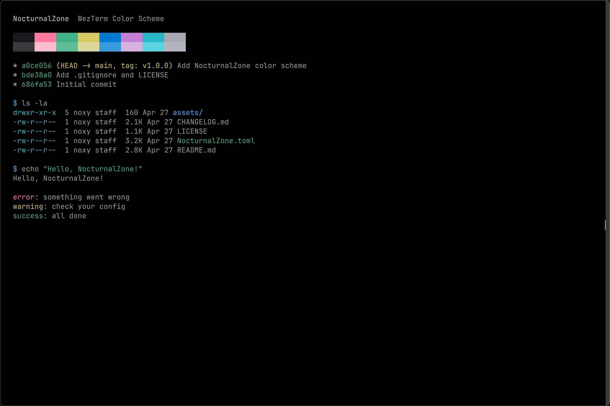

# NocturnalZone — WezTerm Color Scheme

A dark terminal color scheme for [WezTerm](https://wezfurlong.org/wezterm/) based on the NocturnalZone brand palette.



## Installation

### Manual

Copy `NocturnalZone.toml` to your WezTerm colors directory:

```bash
mkdir -p ~/.config/wezterm/colors
cp NocturnalZone.toml ~/.config/wezterm/colors/
```

Then enable it in `~/.config/wezterm/wezterm.lua`:

```lua
config.color_scheme = "NocturnalZone"
```

### WezTerm Built-in Schemes

This theme is being submitted to [WezTerm](https://github.com/wezterm/wezterm). Once accepted, no manual installation is needed — just set `config.color_scheme = "NocturnalZone"`.

## Palette

### Base

| Role            | Hex       |
| --------------- | --------- |
| Background      | `#000000` |
| Foreground      | `#9d9da6` |
| Cursor          | `#a9a9b3` |
| Selection BG    | `#2c2c2e` |
| Selection FG    | `#b0b4be` |
| Scrollbar Thumb | `#3a3a3c` |
| Split           | `#3a3a3c` |

### ANSI Colors

| #   | Name           | Hex       |
| --- | -------------- | --------- |
| 0   | Black          | `#18181d` |
| 1   | Red            | `#ff7a9e` |
| 2   | Green          | `#3fb085` |
| 3   | Yellow         | `#d6c95f` |
| 4   | Blue           | `#007acc` |
| 5   | Magenta        | `#c47fd4` |
| 6   | Cyan           | `#27b8c8` |
| 7   | White          | `#a9a9b3` |
| 8   | Bright Black   | `#3a3a3c` |
| 9   | Bright Red     | `#fbbccc` |
| 10  | Bright Green   | `#5cbc98` |
| 11  | Bright Yellow  | `#dcd497` |
| 12  | Bright Blue    | `#389adc` |
| 13  | Bright Magenta | `#d6b3de` |
| 14  | Bright Cyan    | `#5bd2e0` |
| 15  | Bright White   | `#b0b4be` |

### Tab Bar

| State              | BG        | FG        |
| ------------------ | --------- | --------- |
| tab_bar background | `#000000` | —         |
| active_tab         | `#18181d` | `#b0b4be` |
| inactive_tab       | `#000000` | `#636366` |
| inactive_tab_hover | `#2c2c2e` | `#a9a9b3` |
| new_tab            | `#000000` | `#636366` |
| new_tab_hover      | `#2c2c2e` | `#a9a9b3` |

## License

[MIT](LICENSE)
